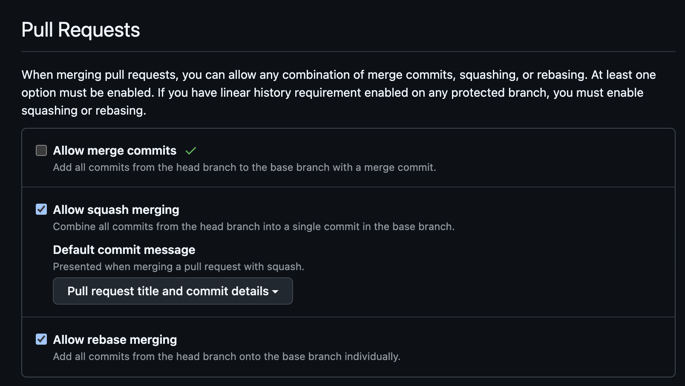

# Semantic Release GitHub Action

This GitHub Action automatically creates semantic versioned releases based on commit messages and PR titles following the [Conventional Commits](https://www.conventionalcommits.org/) format.

# What does this do?
This action will compare the commit messages between the latest release and now and based on the history a new Release will be made with the proper versioning.

All PRs that are included in a release are notified about which release their change was included in.

## Quick Setup

1. Copy the below config to the `.github/workflows/release.yml` file in your repository.

```yaml
name: Release

on:
  workflow_dispatch:

jobs:
  release:
    name: Release
    runs-on: ubuntu-latest
    # Only run on merged PRs or direct pushes to main
    
    permissions:
      contents: write      # For creating releases
      pull-requests: write # For commenting on PRs
      
    steps:
      - name: Checkout
        uses: actions/checkout@v5
        
      # Using an action from the local repository
      - name: Semantic Release
        uses: ./.github/actions/semantic-release

```

3. Use the Conventional Commit messaging for your PR titles and or commit messages.

4. (Optional) - Configure the repository's default Pull Request settings to favor Squash and Merge.
- `https://github.com/< your-org >/< your-repo >/settings`


That's it! Your repository will now automatically create releases based on semantic commit messages.

## Commit Message Format

This action relies on [Conventional Commits](https://www.conventionalcommits.org/) to determine version numbers and generate changelogs. Your commits should follow this format:

```
<type>[optional scope]: <description>

[optional body]

[optional footer(s)]
```

Common types:
- `feat`: A new feature (triggers a minor version bump)
- `fix`: A bug fix (triggers a patch version bump)
- `docs`: Documentation changes
- `style`: Code style changes (formatting, etc.)
- `refactor`: Code refactoring with no feature changes
- `perf`: Performance improvements
- `test`: Adding or updating tests
- `chore`: Updates to build process, dependencies, etc.

Breaking changes (which trigger a major version bump) are indicated with a `!` or a `BREAKING CHANGE:` footer:

```
feat!: incompatible API change

or

feat: new feature

BREAKING CHANGE: incompatible API change
```

## PR Titles

If you merge PRs, the action will also analyze the PR title for semantic versioning. Format your PR titles following the same Conventional Commits format for automatic versioning.

Examples:
- `feat(api): add user authentication`
- `fix: resolve login bug`
- `docs(readme): update installation guide`
- `fix(PL-1234): resolve timeout`

## Permissions

This action requires the following GitHub permissions:
- `contents: write` - To create releases
- `pull-requests: write` - To comment on PRs

These permissions are already configured in the workflow file.

## Customization

This action generates its semantic-release config on the fly — the "Create release config" step in [`action.yml`](action.yml) writes a `.releaserc.json` into a throwaway `semantic-release/` directory on the runner each run, and it is never committed back to your repository. To change the release behavior (plugins, commit message, branches, etc.), edit that heredoc in `action.yml` according to the [semantic-release documentation](https://semantic-release.gitbook.io/semantic-release/usage/configuration).

## GitHub Secrets

- The action uses `secrets.GITHUB_TOKEN` which is provided automatically by GitHub Actions.
- If you need to publish to npm, add your `NPM_TOKEN` to the repository secrets.
